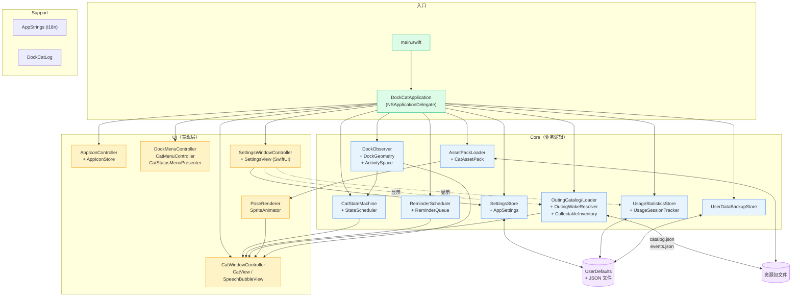
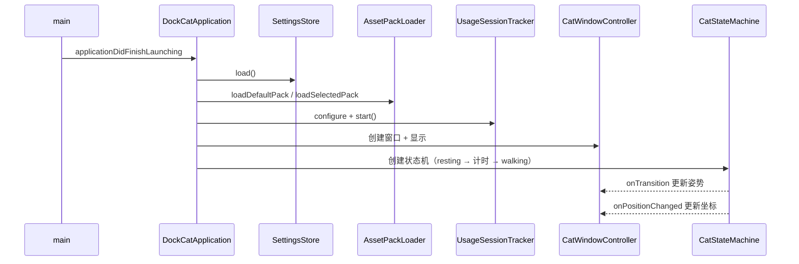
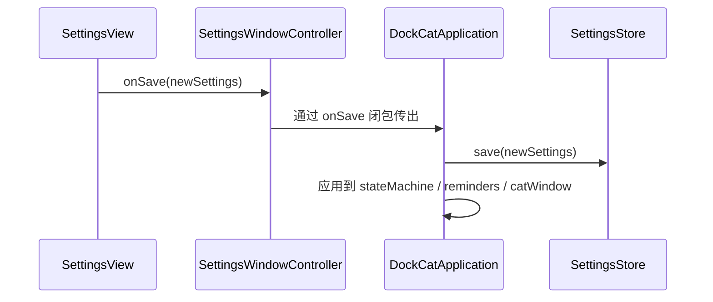

# DockCat 架构说明

DockCat 是一个 macOS 桌面陪伴 App：一只猫住在 Dock 边上，会休息、走动、出门带礼物，并提醒用户喝水/起身。本文整理了它的代码结构与运行时数据流。

---

## 一、项目类型与技术栈

| 项目 | 选择 |
| --- | --- |
| 平台 | macOS 12+（Intel / Apple Silicon） |
| 语言 | Swift |
| UI | AppKit (NSWindow、NSStatusItem) + SwiftUI（设置面板） |
| 持久化 | `UserDefaults` + `JSONEncoder/Decoder`，JSON 资源包 |
| 入口 | `main.swift` 启动 `NSApplication` |
| 总计 | 49 个 Swift 文件，约 700 个符号 |

无依赖管理工具（无 Package.swift / Cartfile / Podfile）—— 纯 Swift + 系统框架。

---

## 二、目录结构

```
DockCatApp/DockCat/
├── App/                       # 应用入口与生命周期
│   ├── main.swift             # NSApplication.shared.run()
│   ├── DockCatApplication.swift  # NSApplicationDelegate，组装所有依赖
│   └── AppState.swift         # 运行时打包结构：settings / activitySpace / assetPack
│
├── Core/                      # 业务逻辑（与 UI 无关）
│   ├── Assets/                # 猫咪资源包加载（图片、manifest.json）
│   ├── Backup/                # 用户数据备份（UserDataBackupStore）
│   ├── Dock/                  # 监听 Dock 位置、计算可活动区域
│   ├── Outing/                # “猫出门”系统：事件、收藏品、奖励
│   ├── Reminder/              # 喝水/起身/自定义提醒调度
│   ├── Settings/              # AppSettings 模型 + SettingsStore 持久化
│   ├── StateMachine/          # 猫的状态机（rest / walk / outing / dialogue / held）
│   └── Statistics/            # 使用时长 + 提醒完成统计
│
├── Support/                   # 通用工具
│   ├── AppStrings.swift       # 中/英文文案（手写 i18n）
│   ├── Logger.swift           # OSLog 封装
│   ├── TimeFormatter.swift
│   ├── GeometryUtils.swift
│   └── RuntimeDiagnostics.swift
│
└── UI/                        # 表现层
    ├── AppIcon/               # Dock 图标切换（睡眠/空白图标）
    ├── CatWindow/             # 浮在桌面上的小猫窗口 + 鼠标交互
    ├── Menus/                 # Dock 菜单、状态栏菜单、右键菜单
    └── Settings/              # 设置窗口（SwiftUI），含 4 个 Tab
```

---

## 三、架构图



---

## 四、关键模块说明

### 4.1 入口 / 装配（`App/`）

`DockCatApplication` 是依赖装配中心。它把所有 Store / Loader / Controller 都作为私有属性持有，然后在 `applicationDidFinishLaunching` 里：

1. `settingsStore.load()` → 拿到 `AppSettings`
2. 解析显示器与 Dock 几何信息 → 得到 `ActivitySpace`（猫的活动范围）
3. 加载 `OutingCatalog` 与 `CollectableInventory`
4. 启动 `UsageSessionTracker`（监听屏幕亮灭、累加在屏时长）
5. 加载默认资源包 + 用户选定的资源包
6. 初始化 `PoseRenderer` / `CatWindowController` / `SettingsWindowController`
7. 构建 `CatStateMachine`、`ReminderScheduler`、各类 Timer

`applicationWillTerminate` 负责清理 Timer、保存统计、写备份。

### 4.2 状态机（`Core/StateMachine/`）

`CatStateMachine` 管理 `CatState`（resting / walking / transition / held / dialogue / outing）的转移与计时：

- `StateScheduler` 是单 Timer 封装，安排"X 秒后切换状态"
- 状态切换通过 `onTransition` / `onDurationScheduled` 闭包通知 UI 与提醒系统
- 走动速度、休息/散步时长范围都来自 `AppSettings`

### 4.3 持久化模式

整个项目反复用同一种 Store 模式（参见 `SettingsStore.swift:3`、`UsageStatisticsStore.swift:3`）：

```swift
final class XxxStore {
    private let defaults: UserDefaults
    private let key = "DockCat.Xxx.v1"

    func load() -> Xxx { /* 解码 JSON，失败回退默认值 */ }
    func save(_ x: Xxx) { /* JSON 编码后写入 UserDefaults */ }
    func reset() { defaults.removeObject(forKey: key) }
}
```

这种"小而独立的 Store + Codable 模型"是接入新模块的标准入口。

### 4.4 资源包（`Core/Assets/`）

- `CatAssetPack` = `manifest.json` 描述 + 一组图片文件
- `AssetPackLoader` 支持默认包 + 用户在 `CatPacks/` 目录下放的自定义包
- `AssetManifest` 描述每个状态需要哪些图片、走动动画的 FPS 等
- 加载失败的状态会回退到默认包（避免出现"隐形猫"）

### 4.5 出门系统（`Core/Outing/`）

最复杂的子系统：

- `OutingCatalog`：从 `events.json` / `collectables.json` 读取所有事件与可收集品
- `OutingWakeResolver`：app 启动时若发现正在"出门"，解析是否该返回
- `OutingRewardGenerator`：决定带回什么礼物
- `CollectableInventoryStore`：持久化已收集到的物品

### 4.6 设置界面（`UI/Settings/`）

`SettingsView` 是一个纯 SwiftUI 视图，分为 4 个 Tab：

| Tab | 内容 |
| --- | --- |
| 宠物设置（Pet） | 猫名、称呼、缩放、起始位置、资源包、显示器、语言 |
| 参数设置（Parameters） | 提醒间隔与文案、休息/散步时长、走速、出门时长 |
| 收藏品箱（Collectables） | 在屏时长统计 + 提醒完成次数 + 收集到的物品网格 |
| 支持（About） | 版本号、项目链接、赞赏按钮 |

注意：使用统计就在"收藏品箱" Tab 顶部展示，并非独立 Tab。

---

## 五、数据流（典型场景）

### 启动流程



### 用户保存设置



---

## 六、扩展指南：如何添加一个新模块

参照现有模式，最小侵入地加一个新功能：

1. **建模型**：`Core/<NewFeature>/<NewFeature>.swift`，定义 `Codable` struct
2. **建 Store**：`<NewFeature>Store.swift`，复用 UserDefaults + JSON 模式
3. **建 Controller / Service**（可选）：纯业务逻辑，靠闭包回调通知外部
4. **在 `DockCatApplication` 里装配**：声明私有属性，`applicationDidFinishLaunching` 里 `.load()`
5. **在 `AppStrings` 里加文案**：中/英两套
6. **在 `SettingsView` 里加 UI**：新增 Tab 或加入现有 Tab
7. **通过 `SettingsWindowController` 把数据 / 回调注入 SwiftUI**

这种模式天然避免动到状态机、动画等核心代码。
