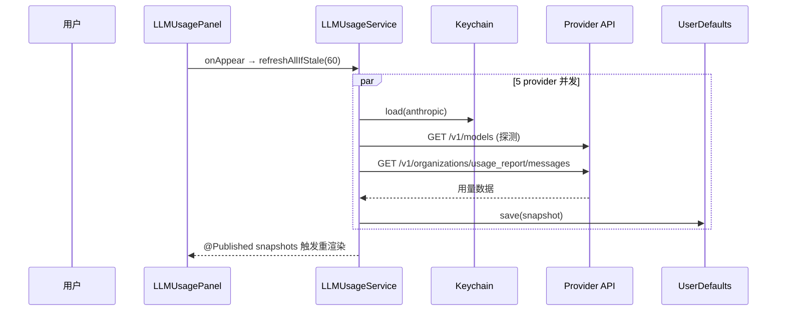
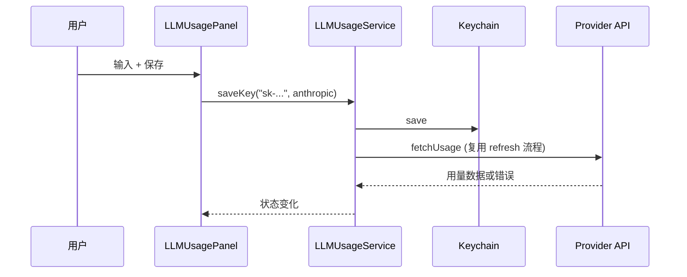

# LLM 用量面板 · 设计文档

- **日期**：2026-05-26
- **状态**：设计已确认，待实施
- **目标**：在 DockCat 设置窗口新增一个 "LLM 用量" Tab，展示用户在 5 家主流 LLM provider 的余额与花费数据。
- **约束**：对原项目改动最小化，不动状态机 / 动画 / Dock 监听 / 出门 / 备份 / 资源包加载等核心模块。

---

## 1. 范围

### 1.1 支持的 Provider

| Provider | 币种 | 数据深度 |
| --- | --- | --- |
| Anthropic | USD | 余额、本月花费、按模型 token 拆分 |
| OpenAI | USD | 本月花费、按模型 token 拆分（新付费模式无"余额"概念，显示 "—"） |
| OpenRouter | USD | 余额、累计花费 |
| DeepSeek | CNY | 余额 |
| Kimi (Moonshot) | CNY | 余额 |

### 1.2 设计原则

1. **多币种共存**，不做汇率换算 —— 每家展示自己原生币种
2. **Provider 协议 + 注册表** 架构，新增一家 provider = 加一个文件 + 一行注册
3. **API key 存 macOS Keychain**，不走 UserDefaults
4. **手动刷新优先**，打开 Tab 时自动刷新一次（60s 内缓存有效）
5. **错误不污染已有成功数据**：失败时同时显示"上次成功的数据 + 当前错误"

### 1.3 非目标（不做）

- 汇率换算 / 多币种合计
- 后台定时轮询
- 按日期范围筛选 / 历史趋势图表
- iCloud Keychain 同步
- 通过桌面小猫主动提示用量（如"今天花了好多 token"气泡）
- 修改任何现有的核心模块

---

## 2. 架构

### 2.1 模块结构

```
DockCatApp/DockCat/
├── Core/
│   └── LLMUsage/                          # 新增模块
│       ├── LLMUsageProvider.swift         # 协议
│       ├── LLMProviderID.swift            # 枚举 ID
│       ├── ProviderUsageSnapshot.swift    # 数据模型
│       ├── LLMUsageError.swift            # 错误类型
│       ├── LLMKeychainStore.swift         # Keychain 封装
│       ├── LLMUsageStore.swift            # UserDefaults 持久化快照
│       ├── LLMUsageService.swift          # 协调器（注册表 + 并发拉取）
│       └── Providers/
│           ├── AnthropicUsageProvider.swift
│           ├── OpenAIUsageProvider.swift
│           ├── OpenRouterUsageProvider.swift
│           ├── DeepSeekUsageProvider.swift
│           └── KimiUsageProvider.swift
└── UI/
    └── Settings/
        ├── SettingsView.swift             # 改：+1 tabItem
        ├── SettingsWindowController.swift # 改：+1 init 参数 + 透传
        └── LLMUsagePanel.swift            # 新：Tab 内容（SwiftUI）
```

### 2.2 受影响的现有文件

| 文件 | 变动类型 | 行数估计 |
| --- | --- | --- |
| `Core/LLMUsage/` 整目录 | 新增（12 文件） | ~700 |
| `UI/Settings/LLMUsagePanel.swift` | 新增 | ~250 |
| `UI/Settings/SettingsView.swift` | +1 tabItem 调用 | +5 |
| `UI/Settings/SettingsWindowController.swift` | +1 init 参数 + 透传到 SettingsView | +15 |
| `App/DockCatApplication.swift` | +1 私有属性 + 1 构造参数 | +3 |
| `Support/AppStrings.swift` | +15 条新文案（中/英） | +35 |

不修改：状态机、动画、Dock 监听、出门系统、备份、资源包加载、提醒系统。

---

## 3. 数据模型

```swift
enum LLMProviderID: String, Codable, CaseIterable {
    case anthropic, openai, openrouter, deepseek, kimi
}

struct ProviderUsageSnapshot: Codable, Equatable {
    let providerID: LLMProviderID
    let fetchedAt: Date
    let state: State

    enum State: Codable, Equatable {
        case missingKey                          // 用户未配置 key
        case keyValidNoUsageAccess(hint: String) // key 有效但权限不够（仅 Anthropic / OpenAI）
        case success(UsageData)
        case failure(reason: String)             // key 错 / 网络 / 限流 / 解析错
    }
}

struct UsageData: Codable, Equatable {
    let balance: Money?                          // 可空（OpenAI 无此概念）
    let totalSpent: Money?                       // 已花费，语义因 provider 而异（见下）
    let totalSpentLabel: SpentLabel              // 决定 UI 显示"本月花费"还是"累计花费"
    let modelBreakdown: [ModelUsage]?            // 仅 Anthropic / OpenAI 提供
}

enum SpentLabel: String, Codable {
    case thisMonth   // Anthropic / OpenAI: 按月统计
    case lifetime    // OpenRouter: 累计花费
}

struct Money: Codable, Equatable {
    let amount: Decimal                          // 用 Decimal 避免浮点误差
    let currency: String                         // "USD" / "CNY"
}

struct ModelUsage: Codable, Equatable {
    let modelName: String                        // "claude-sonnet-4-7" / "gpt-4o"
    let inputTokens: Int
    let outputTokens: Int
    let cost: Money
}
```

### 3.1 关键决策

- **`State` 是强类型 enum**：UI 渲染靠 switch 全覆盖，不会出现"既有 error 又有 data"的模糊态
- **`balance` / `totalSpent` / `modelBreakdown` 全可空**：provider 拿不到就 nil，UI 显示 "—"
- **`Money` 用 `Decimal`**：财务数字，避免 Double 的精度问题

---

## 4. Provider 协议

```swift
protocol LLMUsageProvider {
    var id: LLMProviderID { get }
    var displayName: String { get }
    var supportsModelBreakdown: Bool { get }
    var requiresAdminKey: Bool { get }            // true: anthropic / openai
    var helpURL: URL { get }                       // "如何获取 Admin Key?" 跳转链接
    func fetchUsage(apiKey: String) async throws -> ProviderUsageSnapshot
}
```

`fetchUsage` 返回完整的 `ProviderUsageSnapshot`（包含 state），失败也由 provider 内部决定是 `.failure` 还是 `.keyValidNoUsageAccess`。这样 `LLMUsageService` 不需要懂 provider 特有的错误码。

只有"完全意外"的错误（如 Keychain 读不到、Task cancel）才抛 `throw`，由 service 兜底为 `.failure`。

---

## 5. 各 Provider 实现细节

### 5.1 Anthropic（USD，需要 Admin Key）

- **探测端点**：`GET https://api.anthropic.com/v1/models`
  - Header: `x-api-key: <key>`, `anthropic-version: 2023-06-01`
  - 200 → key 有效；401 → `.failure("Invalid API key")`
- **用量端点**：`GET https://api.anthropic.com/v1/organizations/usage_report/messages`
  - Header: 同上
  - 200 → 解析按模型的 token 拆分
  - 401/403 + 错误体提示需要 admin scope → `.keyValidNoUsageAccess("此 key 有效，但需要 Admin Key 才能查询用量")`
- **花费端点**：`GET https://api.anthropic.com/v1/organizations/cost_report`
  - 200 → 解析 totalSpent
- **`requiresAdminKey = true`**
- **`helpURL`**: `https://console.anthropic.com/settings/admin-keys`

### 5.2 OpenAI（USD，需要 Admin Key）

- **探测端点**：`GET https://api.openai.com/v1/models`
  - Header: `Authorization: Bearer <key>`
  - 200 → 有效；401 → 失败
- **用量端点**：`GET https://api.openai.com/v1/organization/usage/completions?start_time=<本月初>`
  - 200 → 解析模型拆分
  - 401/403 → `.keyValidNoUsageAccess(...)`
- **花费端点**：`GET https://api.openai.com/v1/organization/costs?start_time=<本月初>`
- **OpenAI 无余额概念**：`balance = nil`，UI 显示 "—"
- **`requiresAdminKey = true`**
- **`helpURL`**: `https://platform.openai.com/settings/organization/admin-keys`

### 5.3 OpenRouter（USD，普通 key 即可）

- **端点**：`GET https://openrouter.ai/api/v1/credits`
  - Header: `Authorization: Bearer <key>`
  - 200 → `{ total_credits, total_usage }` → 算出 `balance = total_credits - total_usage`, `totalSpent = total_usage`
- **`requiresAdminKey = false`**
- **`supportsModelBreakdown = false`**

### 5.4 DeepSeek（CNY，普通 key）

- **端点**：`GET https://api.deepseek.com/user/balance`
  - Header: `Authorization: Bearer <key>`
  - 200 → `balance_infos` 数组，取 `currency == "CNY"` 那条
- **`requiresAdminKey = false`**
- **`supportsModelBreakdown = false`**
- **totalSpent**: 接口未提供，nil

### 5.5 Kimi / Moonshot（CNY，普通 key）

- **端点**：`GET https://api.moonshot.cn/v1/users/me/balance`
  - Header: `Authorization: Bearer <key>`
  - 200 → 解析 `balance` 字段
- **`requiresAdminKey = false`**
- **`supportsModelBreakdown = false`**

---

## 6. Keychain 封装

```swift
final class LLMKeychainStore {
    private let service = "com.dockcat.llm-usage"

    func save(_ key: String, for provider: LLMProviderID) throws
    func load(_ provider: LLMProviderID) -> String?
    func delete(_ provider: LLMProviderID) throws
    func hasKey(for provider: LLMProviderID) -> Bool   // 不暴露明文
}
```

### 6.1 Keychain 属性

- `kSecClass = kSecClassGenericPassword`
- `kSecAttrService = "com.dockcat.llm-usage"`（固定）
- `kSecAttrAccount = provider.rawValue`（区分 5 家）
- `kSecAttrAccessible = kSecAttrAccessibleAfterFirstUnlock`（开机自启时可读）
- **不设 `kSecAttrSynchronizable`**：不同步到 iCloud Keychain

### 6.2 Key 校验流程

不在粘贴瞬间触发请求。校验时机：

1. **失去焦点后 300ms** → 异步 fetchUsage
2. **点"保存"** → 立即 fetchUsage
3. **点"刷新"** → 同样的 fetchUsage

校验和拉数据是同一个调用，不写两套。

### 6.3 Key 删除副作用

`clearKey(_:)` 必须同时：

1. 从 Keychain 删除对应 item
2. 从 `LLMUsageStore` 删除该 provider 的缓存快照
3. 将内存中的 snapshot 重置为 `.missingKey`

避免"删了 key 但旧数据还在 UI 上飘着"。

---

## 7. 服务编排（`LLMUsageService`）

```swift
@MainActor
final class LLMUsageService: ObservableObject {
    @Published private(set) var snapshots: [LLMProviderID: ProviderUsageSnapshot]
    @Published private(set) var refreshingIDs: Set<LLMProviderID>

    private let providers: [LLMProviderID: any LLMUsageProvider]
    private let keychain: LLMKeychainStore
    private let store: LLMUsageStore
    private let now: () -> Date

    init(
        keychain: LLMKeychainStore = .init(),
        store: LLMUsageStore = .init(),
        now: @escaping () -> Date = Date.init
    )

    func refreshAll() async
    func refresh(_ id: LLMProviderID) async
    func refreshAllIfStale(maxAge: TimeInterval) async   // 60s 缓存判定
    func saveKey(_ key: String, for id: LLMProviderID) async
    func clearKey(_ id: LLMProviderID)
}
```

### 7.1 并发模型

`refreshAll` 用 `withTaskGroup`，5 家并发拉，互不阻塞。`refreshingIDs` 集合允许 UI 给每张卡片显示独立 spinner。

### 7.2 缓存策略

- 内存中维持 `snapshots: [ID: Snapshot]`，UI 直接订阅
- 每次成功 / 失败都写入 `LLMUsageStore`（UserDefaults JSON），下次启动还原
- `refreshAllIfStale(maxAge: 60)`：以 `snapshot.fetchedAt` 为准（不论该 snapshot 是 success 还是 failure 都算"已尝试过"），距今不足 60s 则跳过 —— 避免连续打开/关闭 Tab 时反复请求

### 7.3 错误处理与降级

| 错误 | 处理 |
| --- | --- |
| 无网络 | provider 抛 → 转为 `.failure("无网络连接")`，旧 snapshot 仍可显示 |
| HTTP 401（key 错） | `.failure("Invalid API key")` |
| HTTP 401/403（scope 不够）| `.keyValidNoUsageAccess(hint:)` |
| HTTP 429 | `.failure("请求过快，稍后再试")`，刷新按钮 30s 内变灰 |
| JSON 解析失败 | `.failure("响应格式异常")` + 写 `DockCatLog.app.error` |
| Keychain 失败 | `.failure("无法访问钥匙串：\(status)")` + 写日志 |
| Task cancel | 不写入半成品状态 |

**关键**：错误不覆盖旧的成功快照对外可见状态。UI 同时渲染"上次成功数据 + 当前错误标记"：

```
余额    $12.34   (15 分钟前)
⚠ 当前刷新失败：Invalid API key   [重试]
```

---

## 8. UI 设计

### 8.1 整体布局

设置窗口 520×580，"LLM 用量" Tab 内容：

```
┌────────────────────────────────────────────────────────┐
│  ⟳ 刷新所有  · 上次更新于 14:23                            │  ← 顶栏
├────────────────────────────────────────────────────────┤
│  ╔══ Anthropic ════════════════════════════════ ⚠ ═╗   │
│  ║ ✓ Key 已连接 · 升级到 Admin Key 才能查看用量       ║   │
│  ║                                  [如何获取?] [修改]║   │
│  ╚════════════════════════════════════════════════════╝│
│                                                        │
│  ╔══ OpenAI ═══════════════════════════════════ ● ═╗   │
│  ║   未配置                                         ║   │
│  ║   sk-admin-...  [_________________]  [保存]      ║   │
│  ╚══════════════════════════════════════════════════╝   │
│                                                        │
│  ╔══ OpenRouter ═══════════════════════════════ ✓ ═╗   │
│  ║   余额    $12.34                                ║   │
│  ║   累计花费 $87.65                                ║   │
│  ║   ••••••••••••••                  [修改] [清除]   ║   │
│  ╚══════════════════════════════════════════════════╝   │
│  ... (DeepSeek, Kimi 同理)                              │
└────────────────────────────────────────────────────────┘
```

### 8.2 状态图标

| State | 图标 | 颜色 |
| --- | --- | --- |
| `missingKey` | ● | 灰 |
| `keyValidNoUsageAccess` | ⚠ | 琥珀 |
| `success` | ✓ | 绿 |
| `failure` | ✗ | 红 |

### 8.3 卡片展开（仅 Anthropic / OpenAI 且为 `success` 状态）

只有 `state == .success(_)` 且 `modelBreakdown != nil` 才显示"▾"图标可展开。其余状态（missingKey / keyValidNoUsageAccess / failure）卡片是固定高度，无展开。

展开后按花费降序排列，最多 5 条 + "查看更多"链接：

```
╔══ Anthropic ═════════════════════════════════ ✓ ▾═╗
║   余额    $-                                       ║
║   本月花费 $42.18                                   ║
║   ──────────────────────────────────────────────  ║
║   claude-sonnet-4-7    输入 1.2M    输出 380K   $28.40║
║   claude-opus-4-6      输入 240K    输出 95K    $13.78║
║   claude-haiku-4-5     输入 80K     输出 12K    $0.00 ║
║   ••••••••••••••                       [修改] [清除]║
╚══════════════════════════════════════════════════╝
```

### 8.4 Key 输入框

- 用 `SecureField`，输入显示 `••••••`
- 已存 key 时：显示 `••••••••` 占位 + "修改"按钮（避免误覆盖）
- "清除"按钮：触发 `clearKey`

### 8.5 顶栏行为

- "刷新所有"：disable 期间所有 provider 并发刷新
- "上次更新于 14:23"：取所有 snapshot 中最早的 `fetchedAt`（保守显示）

### 8.6 Tab `onAppear`

```swift
.onAppear {
    Task { await viewModel.refreshAllIfStale(maxAge: 60) }
}
```

### 8.7 文案（`AppStrings` 新增）

约 15 条中英对照，包括：Tab 标题、刷新按钮、"未配置"、"如何获取?"、"余额"、"本月花费"、各类错误提示等。

---

## 9. 在 `DockCatApplication` 中装配

只加 3 处：

```swift
// 1. 顶部属性声明
private let llmUsageService = LLMUsageService()

// 2. applicationDidFinishLaunching 构造 SettingsWindowController 时
settingsWindowController = SettingsWindowController(
    store: settingsStore,
    settings: settings,
    usageStatistics: usageSessionTracker.snapshot,
    outingCatalog: outingCatalog,
    collectableInventory: collectableInventory,
    dialogueImage: renderer.randomPose(for: .dialogue).image,
    llmUsageService: llmUsageService           // ← 新增参数
)
```

3. `SettingsWindowController.init` 接收 `llmUsageService` 并透传给 `SettingsView`。

---

## 10. 数据流（典型场景）

### 10.1 打开 Tab



### 10.2 用户粘贴新 Key



---

## 11. 测试策略

- **协议化注入**：所有 provider 实现 `LLMUsageProvider`，测试时注入 `MockProvider`，不打真实 API
- **时间可注入**：`LLMUsageService` 接受 `now: () -> Date` 闭包，方便测试过期逻辑
- **集成 smoke test**：通过环境变量提供真实 key 跑一次 fetch（CI 默认跳过）
- **手动测**：5 provider × 5 状态 = 25 个 UI case，逐个截图验证

---

## 12. 验收标准

- [ ] 5 家 provider 均能配置 / 修改 / 清除 key（key 落 Keychain）
- [ ] 设置中"LLM 用量" Tab 打开时自动刷新一次（60s 缓存有效）
- [ ] 各种状态（missingKey / keyValidNoUsageAccess / success / failure）UI 正确显示
- [ ] Anthropic / OpenAI 普通 key → `keyValidNoUsageAccess` + 引导文案 + 跳转链接
- [ ] Anthropic / OpenAI Admin key → 显示按模型 token 拆分
- [ ] DeepSeek / Kimi 显示 CNY，OpenRouter 显示 USD，互不换算
- [ ] 刷新失败时同时显示"上次成功数据 + 当前错误"
- [ ] 删除 key 后，UI 立即回到 `missingKey` 状态且无残留数据
- [ ] 中文 / 英文文案全覆盖
- [ ] 原项目所有现有功能（小猫动画、提醒、出门、设置其它 Tab）不受影响

---

## 13. 风险与未决项

| 风险 | 应对 |
| --- | --- |
| OpenAI / Anthropic admin API 端点变动 | 错误码 → 文案，不让 app 崩；写日志方便定位 |
| Provider 接口字段名小幅变动（如 `total_credits` → `credits`）| 用宽容解码（多个候选 key）+ 失败兜底为 `.failure("响应格式异常")` |
| 用户在小猫主窗口打开期间从 Keychain 手动删了 key | 下次 refresh 时自动转为 `.missingKey` |
| Anthropic Admin API 实际响应字段（usage_report / cost_report）需要实测确认 | 实施第一步先用 curl 实测 5 家接口，落地真实 schema 后再写解码器 |

---

## 14. 后续可扩展项（本期不做）

- 按日期范围筛选 / 趋势折线图
- 小猫主窗口冒泡提示"今天花了 $X" / "钱包余额低于 $Y"
- 导出 CSV
- 接入 Google Gemini（需 GCP Billing API，复杂度高一档）
- 多账号支持（同一 provider 多个 key）
- 汇率换算 + 多币种合计
