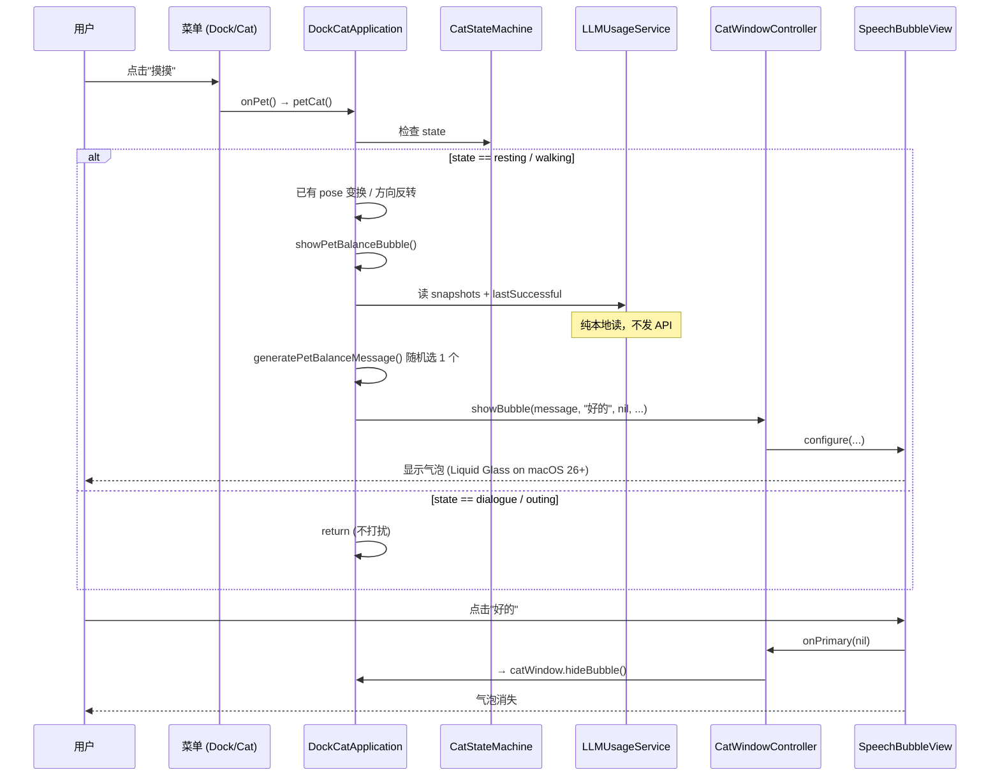

# 摸摸·余额气泡 · 设计文档

- **日期**：2026-05-27
- **状态**：设计已确认，待实施
- **目标**：用户点击右键菜单的"摸摸"时，小猫除了换姿势/反转方向外，**额外弹出一个气泡**，随机展示其中一家已配置 LLM provider 的余额或本月花费。
- **附加目标**：把 `SpeechBubbleView` 背景升级为 **Liquid Glass**（macOS 26+），旧系统保留原样式。

---

## 1. 范围

### 1.1 功能要点

| 项 | 决策 |
| --- | --- |
| 触发方式 | 右键菜单的"摸摸" / dock 菜单的"摸摸"（共享 `petCat()` 入口） |
| 气泡内容 | 随机选 1 个 provider 报数据 |
| 数据源 | 缓存（`LLMUsageService.snapshots` + `lastSuccessful`），不发任何 API |
| 随机池 | 仅含有可用余额数据的 provider（success 或 lastSuccessful） |
| 无数据情况 | 也弹气泡，文案："还没配置任何 LLM 账号呢" / "No LLM accounts configured yet" |
| 气泡按钮 | 单按钮 "好的" / "OK"，点击关闭 |
| 失败的 provider | 不进随机池，不在气泡中提示 |
| Liquid Glass 范围 | 升级 `SpeechBubbleView` —— 提醒/出门/摸摸 三类 bubble 都受益 |
| macOS 26 以下 | 保留现有 layer 背景样式作为 fallback |
| 状态机影响 | 无 —— bubble 是 UI 覆盖层，不让小猫进 `.dialogue` 状态 |
| Dialogue/Outing 状态 | 不显示余额气泡（小猫忙着说话/出门，不打扰） |

### 1.2 非目标（不做）

- 不增加新的点击交互（`onClick` 仍未绑定）
- 不增加每次摸摸都拉新数据
- 不汇总多个 provider（只随机一个）
- 不做汇率换算 / 多币种合计
- 不做"按摸摸频率冷却"逻辑
- 不修改任何 provider 实现 / LLMUsageService

---

## 2. 架构与影响范围

| 文件 | 变动类型 | 行数估计 |
| --- | --- | --- |
| `Core/LLMUsage/LLMProviderID.swift` | 加 `displayName` extension | +10 |
| `Support/AppStrings.swift` | +3 个属性 + 1 个 func | +20 |
| `App/DockCatApplication.swift` | 改 `petCat` + 加 2 个私有方法 | +25 |
| `UI/CatWindow/SpeechBubbleView.swift` | 背景升级，带 availability 守卫 | +15 |

**不动**：state machine、动画、Dock 监听、出门、备份、资源包加载、所有 provider 实现、LLMUsageService、UsageStore、LLMUsagePanel 等。

---

## 3. 数据与文案

### 3.1 `LLMProviderID.displayName`

```swift
extension LLMProviderID {
    var displayName: String {
        switch self {
        case .anthropic:  return "Anthropic"
        case .openai:     return "OpenAI"
        case .openrouter: return "OpenRouter"
        case .deepseek:   return "DeepSeek"
        case .kimi:       return "Kimi"
        }
    }
}
```

### 3.2 AppStrings 新增

```swift
extension AppStrings {
    var petBubbleNoLLM: String {
        language == .chinese ? "还没配置任何 LLM 账号呢" : "No LLM accounts configured yet"
    }

    var petBubbleDismiss: String { language == .chinese ? "好的" : "OK" }

    func petBubbleMessage(providerID: LLMProviderID, data: UsageData) -> String {
        let name = providerID.displayName
        if let balance = data.balance {
            return language == .chinese
                ? "你在 \(name) 还剩 \(balance.formattedDisplay())"
                : "You have \(balance.formattedDisplay()) left on \(name)"
        } else if let spent = data.totalSpent {
            return language == .chinese
                ? "你这个月在 \(name) 花了 \(spent.formattedDisplay())"
                : "You spent \(spent.formattedDisplay()) on \(name) this month"
        } else {
            return language == .chinese ? "\(name) 现在没数据呢" : "\(name) has no data right now"
        }
    }
}
```

---

## 4. 行为逻辑

### 4.1 修改 `petCat()`

```swift
private func petCat() {
    switch stateMachine.state {
    case .resting:
        let pose = renderer.randomPose(for: .resting, fallback: .dialogue)
        catWindow.setImage(pose.image, mirrored: pose.mirrored)
        let point = clampedCatPoint(stateMachine.position)
        stateMachine.updateLongDurationPosition(point)
        catWindow.show(at: point)
        showPetBalanceBubble()              // ← NEW
    case .walking:
        walkDirection *= -1
        catWindow.setMirrored(walkDirection < 0)
        showPetBalanceBubble()              // ← NEW
    default:
        return                              // dialogue / outing 不打扰
    }
}
```

### 4.2 新增私有方法

```swift
private func showPetBalanceBubble() {
    let message = generatePetBalanceMessage()
    catWindow.showBubble(
        message: message,
        primaryTitle: strings.petBubbleDismiss,
        secondaryTitle: nil,
        onPrimary: { [weak self] _ in self?.catWindow.hideBubble() },
        onSecondary: nil
    )
}

private func generatePetBalanceMessage() -> String {
    let pool: [(LLMProviderID, UsageData)] = LLMProviderID.allCases.compactMap { id in
        if let snapshot = llmUsageService.snapshots[id],
           case .success(let data) = snapshot.state {
            return (id, data)
        }
        if let last = llmUsageService.lastSuccessful[id] {
            return (id, last.data)
        }
        return nil
    }
    guard let pick = pool.randomElement() else {
        return strings.petBubbleNoLLM
    }
    return strings.petBubbleMessage(providerID: pick.0, data: pick.1)
}
```

### 4.3 `showBubble` 签名兼容

现有 `CatWindowController.showBubble(message:primaryTitle:secondaryTitle:onPrimary:onSecondary:)` 接受 `secondaryTitle: String?` 和 `onSecondary: (() -> Void)?`。我们传 `nil` 即可。实施时校验当前签名 —— 若 secondaryTitle 必填，则改成空串 + 隐藏，或在 `SpeechBubbleView` 中加可空逻辑。

---

## 5. Liquid Glass 升级

### 5.1 修改 `SpeechBubbleView` 的背景初始化

```swift
override init(frame frameRect: NSRect) {
    super.init(frame: frameRect)
    wantsLayer = true

    if #available(macOS 26.0, *) {
        // Liquid Glass background
        let glass = NSGlassEffectView()
        glass.translatesAutoresizingMaskIntoConstraints = false
        glass.cornerRadius = 16
        addSubview(glass, positioned: .below, relativeTo: nil)
        NSLayoutConstraint.activate([
            glass.leadingAnchor.constraint(equalTo: leadingAnchor),
            glass.trailingAnchor.constraint(equalTo: trailingAnchor),
            glass.topAnchor.constraint(equalTo: topAnchor),
            glass.bottomAnchor.constraint(equalTo: bottomAnchor),
        ])
        layer?.cornerRadius = 16
        layer?.masksToBounds = true
        // 不再设置 layer.backgroundColor / border
    } else {
        // Fallback for macOS 12-25
        layer?.backgroundColor = NSColor.windowBackgroundColor.withAlphaComponent(0.94).cgColor
        layer?.cornerRadius = 8
        layer?.borderColor = NSColor.separatorColor.cgColor
        layer?.borderWidth = 1
    }

    // ... 其它原 label/button/imageView/stepper 配置不变
}
```

### 5.2 API 校准说明（实施时注意）

`NSGlassEffectView` 是 macOS 26 (Tahoe) 新增的 AppKit API。spec 写法基于 WWDC 2025 公开文档预估：

- 可能是单一构造（无参 init）+ `cornerRadius` 属性
- 可能需要 `contentView` 而不是直接 `addSubview`
- 可能需要 `cornerCurve` 配合 `cornerRadius`

实施者拿到 macOS 26 SDK 后用 Xcode 自动补全核对。**结构（availability 守卫 + 添加为底层视图）保持不变**，只调整 API 调用细节即可。

如果 SDK 实际不提供 `NSGlassEffectView`，退化为 `NSVisualEffectView`（`.material = .hudWindow` 或 `.popover`）作为 Liquid Glass 的近似替代品，附 TODO 注释。

### 5.3 影响的 bubble

`SpeechBubbleView` 是所有 bubble 的共享视图。改这一个文件，**三类 bubble 一起升级**：
- 喝水/起身/自定义提醒（reminder）
- 出门对话（outing - asking / leaving / returning）
- **本期新增的"摸摸"余额气泡**

---

## 6. 数据流



---

## 7. 测试策略

由于本期主要是 UI + 文案行为 + 简单的 pure 函数逻辑：

### 7.1 单元测试（可测）

- **`generatePetBalanceMessage()` 的随机池逻辑** —— 可以通过注入 fake snapshots 检验：
  - 都没数据 → 返回 `petBubbleNoLLM`
  - 部分有 success → 只在 success 池里抽
  - 部分有 lastSuccessful 但当前 failure → 也算入池
  - balance != nil → "余额"语句；balance == nil 但 totalSpent != nil → "本月花费"语句
- 但这个函数当前是 `DockCatApplication` 的私有方法，要测就得提出来成单独的纯函数 helper（推荐）。

### 7.2 不能自动测的

- Liquid Glass 视觉效果 —— 只能跑 app 肉眼看
- 气泡显示/消失流程 —— 手动 smoke test
- 状态机 `dialogue`/`outing` 时不打扰的行为 —— 手动验证

### 7.3 建议

把 `generatePetBalanceMessage(snapshots:lastSuccessful:strings:)` 提成 free function（或 static method）方便单元测试。`petCat()` 自己内部代码量少，可以保留无测试。

---

## 8. 验收标准

- [ ] 右键菜单 "摸摸" 在 resting 状态：换姿势 + 弹气泡显示某 provider 余额
- [ ] 右键菜单 "摸摸" 在 walking 状态：反转方向 + 弹气泡
- [ ] dialogue / outing 状态："摸摸" 行为不变（不弹气泡）
- [ ] 没配置任何 LLM 时：气泡显示 "还没配置任何 LLM 账号呢" 文案
- [ ] 至少 1 个 provider 有 success/lastSuccessful 数据时：随机抽一个，文案符合 balance/spent 两种格式
- [ ] 中英文文案完整且正确切换
- [ ] 点 "好的" 按钮气泡关闭
- [ ] macOS 26+ 上，bubble 背景是 Liquid Glass 效果（透明、折射感、连续圆角）
- [ ] macOS 12-25 上，bubble 保持现有 layer 背景样式（功能不退化）
- [ ] 自动化测试全过 + 现有 49 个测试 + 新 `generatePetBalanceMessage` 测试
- [ ] 原有摸摸的视觉效果（姿势变换、方向反转）保留
- [ ] 提醒气泡、出门气泡也吃到了 Liquid Glass 升级（共享 SpeechBubbleView）

---

## 9. 风险与未决项

| 风险 | 应对 |
| --- | --- |
| `NSGlassEffectView` API 与预估不符 | availability 守卫块内调整 init/属性调用；最坏 fallback 到 NSVisualEffectView .hudWindow 材质 |
| 老 macOS 上 build 失败（如 SDK 不识别 NSGlassEffectView） | `#available` 守卫内的代码只在 deployment target 支持时编译；用 `if #available` 而非 `@available` |
| `showBubble` 的 secondaryTitle 强制非空 | 检查 signature；如果强制必填，加重载或传空串 + 在视图里隐藏 |
| 用户狂点"摸摸" → 气泡反复重置 | 当前 `showBubble` 已是 idempotent（替换前一个），现状即可接受 |
| 多个 provider 有数据时随机抽到失败的旧数据 | lastSuccessful 已设计为只保留 success 数据，不会出现这种情况 |

---

## 10. 后续可扩展（本期不做）

- 给左键点击小猫也绑同样的行为（`CatInteractionController.onClick`）
- 加冷却（10s 内点多次只弹一次新数据）
- 摸摸时随机用不同口吻（"嗷～你还有 $25.46 呢" / 严肃模式）
- 不同 provider 用不同的 emoji prefix
